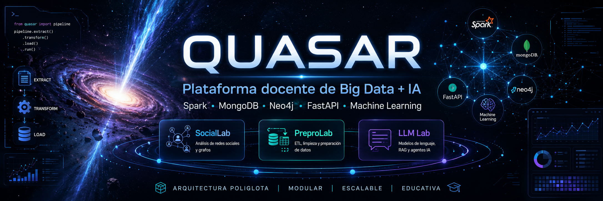

# Quasar



> Plataforma docente de **Big Data + IA** para la asignatura de Tratamiento y Gestión de Datos Masivos.
> Un único stack poliglota (MongoDB + Neo4j + Spark + FastAPI) que aloja **varias aplicaciones independientes**, cada una enseñando un caso de uso distinto del mismo temario.

```
                      ┌─────────────────────────────────────────────────┐
                      │                    QUASAR                       │
                      │     Plataforma común (poliglota + ETL + ML)     │
                      └─────────────────────────────────────────────────┘
                              ▲                ▲                ▲
                              │                │                │
                ┌─────────────┴────┐  ┌────────┴────────┐  ┌────┴──────────┐
                │    SocialLab     │  │    PreproLab    │  │    LLM Lab    │
                │  Red social      │  │  Tema 5 puro    │  │ NLP / nanoGPT │
                │  poliglota       │  │ Preprocesamiento│  │ (planificada) │
                │   :8000          │  │     :8002       │  │    :8001      │
                └──────────────────┘  └─────────────────┘  └───────────────┘

         ┌─────────────────────────────────────────────────────────────────┐
         │  Infraestructura compartida (un solo cluster):                  │
         │    • MongoDB :27017     • Neo4j :7474/:7687                     │
         │    • infra/shared/      • data lake por app                     │
         └─────────────────────────────────────────────────────────────────┘
```

## Por qué existe

Montar un laboratorio docente de Big Data desde cero cuesta **días por curso**: instalar Spark, levantar Mongo + Neo4j, conectar la web, generar datos sintéticos, crear ejercicios… y cada año vuelve a romperse.

Quasar lo resuelve de una sola vez:

- **Un comando** levanta el ecosistema completo: `./lab.sh sociallab up`.
- **Una sola instalación** de Mongo + Neo4j sirve a varias asignaturas (cada app usa su propia base de datos).
- **Ejercicios bloqueables**: el profesor "destapa" bloques con `./lab.sh <app> unlock <bloque>` según avanza el curso. El alumno empieza viendo el esqueleto y va completándolo.
- **Datos sucios reales** generados sintéticamente: cada app trae un escenario narrativo (red social, flota de robots) con problemas intencionados que el alumno debe resolver.
- **De local a cloud sin tocar código**: misma base sirve para Docker local, MongoDB Atlas + Neo4j Aura, o Databricks DBFS.

No es Jupyter, no es Streamlit, no es un boilerplate genérico. Es una **plataforma de laboratorios** pensada específicamente para enseñar arquitecturas modernas de datos en una asignatura universitaria.

## Apps del ecosistema

| App | Estado | Puerto | Tema docente | Bloques | Ejercicios |
|---|---|---|---|---|---|
| [**SocialLab**](apps/sociallab/README.md) | Operativa | `:8000` | Bases poliglotas + Spark ML | 3 Cypher (basic/intermediate/advanced) + 3 ML (supervised/unsupervised/graph_ml) | 33 |
| [**PreproLab**](apps/preprolab/README.md) | Fase 1 — esqueleto | `:8002` | Tema 5 — Preprocesamiento | 8 (eda, missing, outliers, integration, transform, normalize, reduce_dim, reduce_inst) | ~30 previstos |
| **LLM Lab** | Planificada | `:8001` | NLP / LLMs | clean, dedup, tokenize, train | ~15 previstos |

Cada app tiene su propio README con la lista detallada de ejercicios y casos empresariales que cubren.

## Arranque rápido

### En 30 segundos: ver SocialLab funcionando

```bash
git clone https://github.com/PabloCCanizares/Quasar.git
cd Quasar
./lab.sh sociallab up
```

Abre <http://localhost:8000>. La web está vacía (sin datos) pero responde. Para cargar la red social demo:

```bash
./lab.sh sociallab seed         # genera datos sucios
./lab.sh sociallab etl          # Spark ETL + carga MongoDB + Neo4j
```

Recarga la web: ya tiene 2.500 usuarios, ranking de influencers, grafo social, etc.

### Como alumno: completar tu primer ejercicio

```bash
./lab.sh sociallab up exercises   # todo en modo scaffold (sin soluciones)
./lab.sh sociallab seed
./lab.sh sociallab etl
```

Edita `apps/sociallab/src/web/routes/neo4j_basic_ex.py` e implementa el ejercicio `Neo4j-basic-1`. Luego:

```bash
docker compose restart app-sociallab    # FastAPI recarga tu código
```

Recarga la pestaña Neo4j de la web. Si lo implementaste bien, deja de aparecer el placeholder y se muestran las estadísticas reales del grafo.

### Como profesor: destapar bloques según avance el curso

```bash
./lab.sh sociallab up exercises          # arrancar el curso con todo en scaffold
./lab.sh sociallab unlock neo4j basic    # tras la clase de Cypher básico
./lab.sh sociallab unlock ml supervised  # tras la clase de clasificación
./lab.sh sociallab status                # ver qué está desbloqueado
```

## Arquitectura

```text
Quasar/
├── apps/
│   ├── sociallab/                       # Aplicación 1: red social poliglota
│   │   ├── src/{web,spark,seed,models}/
│   │   ├── main.py · Dockerfile · requirements.txt
│   │   └── README.md
│   ├── preprolab/                       # Aplicación 2: Tema 5
│   │   └── ... (misma estructura)
│   └── llmprep/                         # Aplicación 3 (próximamente)
├── infra/
│   ├── shared/                          # Libs Python comunes
│   │   ├── config_base.py               #   defaults + carga .env
│   │   ├── mongo.py                     #   clientes async/sync
│   │   ├── neo4j.py                     #   driver + write helper
│   │   └── spark.py                     #   build_spark con autodetección
│   ├── compose/                         # Orquestación Docker
│   │   ├── docker-compose.yml           #   mongo + neo4j + N apps
│   │   ├── docker-compose.cloud.yml     #   solo apps contra Atlas + Aura
│   │   └── .env.docker                  #   config compartida (URIs, flags)
│   └── data/                            # Data lake por app
│       ├── sociallab/{raw,silver,gold}/
│       └── preprolab/{raw,silver,gold,checkpoints}/
├── docs/                                # Documentación técnica + diagramas
├── notebooks/                           # Cuadernos pedagógicos
├── slides.pdf                           # Slides del curso
└── lab.sh                               # Orquestador: ./lab.sh <app> <cmd>
```

**Reglas de diseño** que cualquier app debe respetar:

1. **Toda la configuración vive en `.env`**. Ningún URI ni ruta hardcoded en el código.
2. **`infra/shared/` es la única fuente de verdad** para clientes Mongo, Neo4j y constructor Spark. Cualquier app importa desde ahí.
3. **Cada app tiene su propia base de datos en Mongo** (`sociallab`, `preprolab`, …) y su propia subcarpeta en `infra/data/`. Comparten servidor, no datos.
4. **Misma imagen Docker para local y cloud**: el cambio es solo `.env`.

## Patrón pedagógico: scaffold / solución

Todas las apps siguen la misma mecánica:

- **Solución** — implementación completa en `apps/<app>/src/.../<modulo>.py`.
- **Scaffold** — esqueleto con `raise NotImplementedError` o `exercise_placeholder` en `apps/<app>/src/.../<modulo>_ex.py` (o equivalente).
- **Flag `LAB_<APP>`** en `infra/compose/.env.docker` lista los bloques desbloqueados. Lo que no esté listado se sirve como scaffold.
- **Selección en runtime**: el código de la app importa la versión solución o scaffold según la variable de entorno. No hay rebuild, solo restart del contenedor (~3 s).
- **Degradación elegante**: si un endpoint devuelve `{"error": "scaffold"}` o un parquet no existe, la UI muestra "ejercicio pendiente" en vez de romperse.

Esto permite distribuir el repo en modo ejercicio (todo scaffold) y que el profesor vaya destapando bloques al ritmo del curso.

## Comandos `lab.sh` (referencia rápida)

```bash
./lab.sh                                  # ayuda general
./lab.sh <app> help                       # ayuda específica de una app

./lab.sh <app> up [exercises|solutions]   # arranca app + sus dependencias
./lab.sh <app> down                       # para SOLO esta app (mongo/neo4j siguen vivos)
./lab.sh <app> status                     # flags actuales + estado de containers
./lab.sh <app> logs [servicio]            # sigue logs
./lab.sh <app> reset                      # borra datos (confirmación)

./lab.sh <app> seed                       # genera datos sucios
./lab.sh <app> etl                        # pipeline raw → silver → gold + carga BBDD
./lab.sh <app> train                      # entrena modelos ML (solo SocialLab por ahora)

./lab.sh <app> unlock <kind> <bloque>     # desbloquea un bloque (lo marca como resuelto)
./lab.sh <app> lock   <kind> <bloque>     # vuelve a esconderlo (scaffold)
./lab.sh <app> solutions                  # desbloquea todos
./lab.sh <app> exercises                  # bloquea todos

./lab.sh <app> cloud                      # arranca contra MongoDB Atlas + Neo4j Aura
./lab.sh <app> cloud-down                 # para el contenedor cloud
```

`<app>` reconocidas: `sociallab` (operativa), `preprolab` (esqueleto), `llmprep` (próximamente).

## Modo cloud (sin Docker pesado)

Para alumnos con máquinas modestas:

```bash
cp apps/sociallab/.env.cloud.example apps/sociallab/.env.cloud
# rellenar URIs de Atlas + Aura free tier
./lab.sh sociallab cloud
```

Solo arranca el contenedor de la app (~150 MB RAM). Mongo y Neo4j viven en la nube. Guía paso a paso en [`docs/MIGRACION_CLOUD.md`](docs/MIGRACION_CLOUD.md).

## Añadir una nueva app

El esqueleto que se siguió para PreproLab es replicable:

1. **Estructura** — `mkdir -p apps/<nombre>/src/{config,web,seed,spark,tests}` y `mkdir -p infra/data/<nombre>/{raw,silver,gold}`.
2. **Boilerplate Python** — copiar `main.py`, `Dockerfile`, `requirements.txt`, `.env.example` de SocialLab/PreproLab y adaptar puertos y nombre de BD Mongo.
3. **Config propio** — `apps/<nombre>/src/config/__init__.py` re-exporta de `infra.shared.config_base` y añade `DATA_LAKE_PATH` y `MONGO_DB` propios.
4. **Servicio en compose** — añadir `app-<nombre>` a `infra/compose/docker-compose.yml` con `hostname`, `ports`, `env_file: .env.docker`, `environment: WEB_PORT/MONGO_DB` específicos, y volúmenes a `infra/data/<nombre>` + `infra/shared`.
5. **Flag y comandos** — añadir `LAB_<NOMBRE>=` a `.env.docker` y un bloque `<nombre>_cmd()` en `lab.sh` (clonando el patrón de `sociallab_cmd()`).
6. **README de la app** — explicando estado, bloques, escenario narrativo y comandos.

Coste: ~1 sesión de trabajo para esqueleto operativo.

## FAQ

**¿Quasar es lo mismo que SocialLab?** No. SocialLab es **una** de las apps que viven dentro de Quasar. El repo se llamaba SocialLab hasta mayo de 2026 y se renombró al refactorizar a este modelo multi-app.

**¿Tengo que instalar Spark, Mongo y Neo4j en mi máquina?** No. Todo corre dentro de Docker. Solo necesitas Docker Desktop y Git. Python 3.11 es opcional (solo para modo nativo o ejecutar utilidades fuera del container).

**¿Puedo correr SocialLab y PreproLab a la vez?** Sí. Cada una usa un puerto distinto y su propia base de datos Mongo, pero comparten el servidor. `./lab.sh sociallab up` y `./lab.sh preprolab up` coexisten sin conflicto.

**¿Qué pasa si edito código de una app?** Restart del contenedor de esa app (~3 s) y FastAPI recarga. No hace falta rebuild de la imagen salvo que cambies `requirements.txt` o el `Dockerfile`.

**¿Y si quiero ver el ETL en un Jupyter en lugar de la web?** Hay notebooks pedagógicos en `notebooks/` que replican parte del flujo. Útiles para clase, no necesarios para usar las apps.

**¿Cómo se versionan los datos del lake?** No se versionan. Los archivos en `infra/data/<app>/{raw,silver,gold}/` están gitignored salvo los `.gitkeep`. Se regeneran con `seed` / `etl` / `train`.

## Documentación

- [`apps/sociallab/README.md`](apps/sociallab/README.md) — SocialLab al detalle (ejercicios Cypher + ML, modo cloud, datos demo).
- [`apps/preprolab/README.md`](apps/preprolab/README.md) — PreproLab (estado, roadmap, escenario de flota de robots).
- [`docs/ARCHITECTURE.md`](docs/ARCHITECTURE.md) — arquitectura técnica.
- [`docs/ARQUITECTURA_POLIGLOTA.md`](docs/ARQUITECTURA_POLIGLOTA.md) — por qué cada motor y para qué.
- [`docs/MIGRACION_CLOUD.md`](docs/MIGRACION_CLOUD.md) — Atlas + Aura paso a paso.

## Notas de desarrollo

- `.env`, `.env.cloud` y datos generados no se versionan.
- Cada app tiene su propio `.env` local en `apps/<app>/.env`. El compartido por Docker vive en `infra/compose/.env.docker`.
- Las libs de `infra/shared/` y los `src/` de cada app son **bind mounts** en el compose: editar en local → restart del contenedor → cambios visibles. Sin rebuild.
- Los flags `LAB_*` se modifican mejor con `./lab.sh <app> unlock|lock` que editando `.env.docker` a mano (el script reinicia el contenedor automáticamente).
