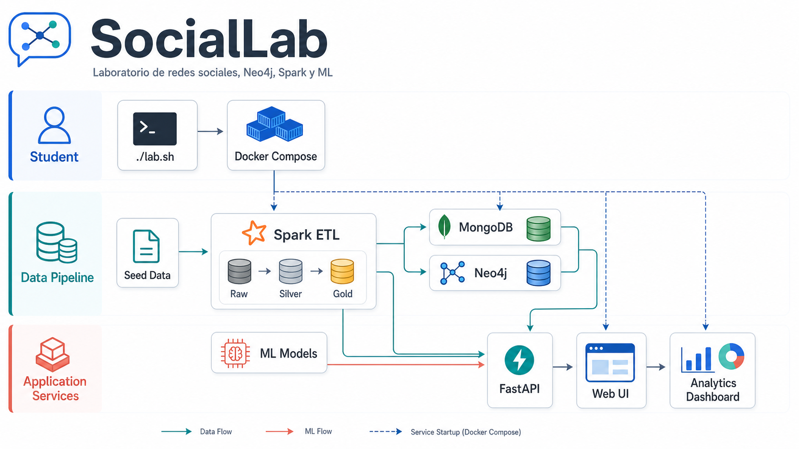

# SocialLab

SocialLab es un laboratorio docente para construir, analizar y explicar una red social completa usando **FastAPI**, **MongoDB**, **Neo4j**, **Spark ETL** y **modelos de Machine Learning**. El proyecto esta pensado para que el estudiante empiece con partes scaffolded, implemente ejercicios concretos y vea el resultado directamente en una web interactiva.



## Que se aprende

- Como modelar una red social con usuarios, posts, likes, follows, hashtags e influencers.
- Como generar datos sucios y transformarlos con un pipeline **raw -> silver -> gold**.
- Como cargar datos analiticos en **MongoDB** y relaciones sociales en **Neo4j**.
- Como escribir consultas **Cypher** progresivas: basicas, intermedias y avanzadas.
- Como entrenar modelos de **ML** para spam, engagement, viralidad, churn, clustering y recomendacion.
- Como conectar todo con una aplicacion web que enseña el estado del laboratorio en tiempo real.

## Arquitectura

SocialLab se ejecuta localmente con Docker Compose y arranca tres servicios principales:

| Servicio | Rol |
| --- | --- |
| `app` | FastAPI, frontend estatico, API REST, Spark local y entrenamiento ML |
| `mongodb` | Base documental para usuarios, posts, interacciones y agregados |
| `neo4j` | Grafo social para follows, comunidades, caminos e influencia |

El flujo de datos es:

1. `./lab.sh seed` genera datos raw en `data/raw/`.
2. `./lab.sh etl` ejecuta Spark y transforma `raw -> silver -> gold`.
3. El ETL carga colecciones en MongoDB y nodos/relaciones en Neo4j.
4. `./lab.sh train` entrena los modelos ML disponibles segun los flags del laboratorio.
5. La web en `http://localhost:8000` consume MongoDB, Neo4j y los artefactos ML.

## Requisitos

- Docker Desktop con Docker Compose.
- Git.
- Python 3.11 si quieres ejecutar utilidades fuera del contenedor.

El flujo normal del estudiante no requiere instalar Spark, MongoDB ni Neo4j en local: viven dentro de Docker.

## Arranque rapido

```bash
./lab.sh up exercises
./lab.sh seed
./lab.sh etl
```

Despues abre:

- Web: `http://localhost:8000`
- Neo4j Browser: `http://localhost:7474`
- Credenciales Neo4j local: `neo4j / neo4jneo4j`

## Comandos principales

| Comando | Para que sirve |
| --- | --- |
| `./lab.sh up` | Arranca con la configuracion actual de `.env.docker` |
| `./lab.sh up exercises` | Arranca todo en modo scaffold |
| `./lab.sh up solutions` | Arranca con todos los bloques resueltos |
| `./lab.sh seed` | Genera datos sucios en `data/raw/` |
| `./lab.sh etl` | Ejecuta Spark, genera silver/gold y carga MongoDB + Neo4j |
| `./lab.sh train` | Entrena modelos ML segun `LAB_ML` |
| `./lab.sh status` | Muestra flags y estado de contenedores |
| `./lab.sh reset` | Borra volumenes y datos generados |
| `./lab.sh logs app` | Muestra logs del servicio `app` |

## Modo laboratorio

SocialLab usa flags en `.env.docker` para decidir si una parte se muestra como ejercicio o como solucion:

```env
LAB_NEO4J=
LAB_ML=
```

Bloques Neo4j:

- `basic`
- `intermediate`
- `advanced`

Bloques ML:

- `supervised`
- `unsupervised`
- `graph_ml`

Ejemplos:

```bash
./lab.sh unlock neo4j basic
./lab.sh unlock neo4j advanced
./lab.sh unlock ml supervised
./lab.sh lock ml supervised
```

Cuando se desbloquea un bloque de ML, el laboratorio reinicia la app y reentrena los modelos necesarios. Cuando un estudiante implementa ejercicios manualmente en Python, debe reiniciar la app para que FastAPI cargue el nuevo codigo:

```bash
docker compose restart app
```

## Ejercicios Neo4j

Los ejercicios de Cypher estan en:

```text
src/web/routes/neo4j_basic_ex.py
src/web/routes/neo4j_intermediate_ex.py
src/web/routes/neo4j_advanced_ex.py
```

Cada fichero tiene una introduccion, objetivos y pistas. Las versiones resueltas equivalentes estan en:

```text
src/web/routes/neo4j_basic.py
src/web/routes/neo4j_intermediate.py
src/web/routes/neo4j_advanced.py
```

La web muestra mensajes de scaffold cuando el bloque aun no esta resuelto. Al completar un ejercicio de Cypher:

```bash
docker compose restart app
```

## Ejercicios ML

Los ejercicios de Machine Learning estan en:

```text
src/spark/models_ex/spam_detector.py
src/spark/models_ex/engagement_predictor.py
src/spark/models_ex/virality_classifier.py
src/spark/models_ex/churn_predictor.py
src/spark/models_ex/user_clustering.py
src/spark/models_ex/follow_recommender.py
```

Las versiones resueltas estan en:

```text
src/spark/models/spam_detector.py
src/spark/models/engagement_predictor.py
src/spark/models/virality_classifier.py
src/spark/models/churn_predictor.py
src/spark/models/user_clustering.py
src/spark/models/follow_recommender.py
```

Al completar un bloque de ML:

```bash
./lab.sh train
docker compose restart app
```

## Datos demo

El seed incluye una red social sintetica con:

- Usuarios normales.
- Influencers inspirados en figuras reconocibles para demos docentes.
- Spammers para activar el detector de spam cuando el bloque ML correspondiente esta implementado.
- Posts, likes, follows, hashtags y relaciones suficientes para explorar comunidades, caminos e influencia.

En la web puedes buscar usuarios por username, explorar perfiles, ver timelines, analizar spam y navegar vistas Neo4j como resumen, influencers, comunidades, radar de alcance y camino mas corto.

## Estructura del proyecto

```text
SocialLab/
├── data/
│   ├── raw/                 # Datos crudos generados por seed
│   ├── silver/              # Datos limpios y normalizados
│   └── gold/                # Agregados y artefactos listos para analitica
├── docs/                    # Documentacion tecnica y diagramas
├── src/
│   ├── seed/                # Generacion de datos sinteticos
│   ├── spark/               # ETL y modelos ML
│   ├── web/                 # FastAPI, rutas, frontend y templates
│   └── models/              # Modelos de dominio
├── docker-compose.yml
├── Dockerfile
├── lab.sh
└── requirements.txt
```

## Flujo recomendado para estudiantes

```bash
./lab.sh up exercises
./lab.sh seed
./lab.sh etl
```

Despues:

1. Abrir la web y comprobar que aparecen los mensajes de ejercicios pendientes.
2. Implementar los ficheros `*_ex.py` o `models_ex/*.py`.
3. Reiniciar la app con `docker compose restart app`.
4. Ejecutar `./lab.sh train` si se han tocado ejercicios de ML.
5. Recargar la web y validar que el panel ya muestra resultados.

## Flujo recomendado para profesor

```bash
./lab.sh up exercises
./lab.sh seed
./lab.sh etl
./lab.sh unlock neo4j basic
./lab.sh unlock ml supervised
./lab.sh status
```

Tambien existe:

```bash
./lab.sh solutions
```

para destapar todos los bloques durante una demo.

## Modo cloud

El proyecto esta preparado para un modo ligero con MongoDB Atlas y Neo4j Aura:

```bash
cp .env.cloud.example .env.cloud
./lab.sh cloud
```

La guia completa esta en `docs/MIGRACION_CLOUD.md`.

## Documentacion adicional

- `docs/ARCHITECTURE.md`: arquitectura tecnica.
- `docs/ARQUITECTURA_POLIGLOTA.md`: vision poliglota de datos.
- `docs/MIGRACION_CLOUD.md`: migracion a Atlas y Aura.
- `src/web/routes/README_NEO4J_EJERCICIOS.md`: mapa de ejercicios Neo4j.
- `src/spark/models_ex/README.md`: mapa de ejercicios ML.

## Notas de desarrollo

- `.env`, `.env.cloud`, datos generados y configuracion local de Claude no se versionan.
- `data/raw`, `data/silver` y `data/gold` se regeneran con `seed`, `etl` y `train`.
- Los cambios en rutas FastAPI requieren reiniciar `app`.
- Los cambios en assets frontend pueden requerir recargar el navegador.
