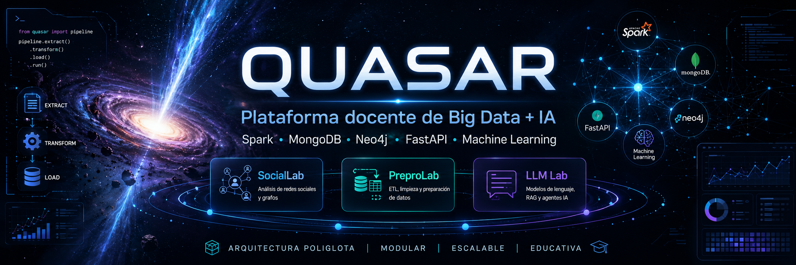

# Quasar



> Laboratorio de **Tratamiento y Gestión de Datos Masivos**: cuatro
> aplicaciones donde practicar el temario completo sobre datos que se parecen
> a los de verdad — sucios, tardíos y a escala.

## Empieza aquí

Necesitas **Docker Desktop** y **Git**. Nada más.

```bash
git clone https://github.com/PabloCCanizares/Quasar.git
cd Quasar
./lab.sh tour
```

El `tour` levanta el ecosistema entero y genera los datos. Tarda dos o tres
minutos la primera vez. Cuando termine, abre <http://localhost:8080>: esa es
la puerta de entrada y el único puerto que necesitas recordar.

Ahí verás el temario del curso: once temas repartidos en cuatro unidades, con
lo que vas a saber al terminar cada uno y cuánto trabajo lleva. Empieza por
donde toque en clase, o de arriba abajo si vas por libre.

## Qué vas a aprender

El curso recorre el camino completo del dato, y cada tramo tiene su
laboratorio:

| Unidad | Pregunta | Dónde se practica |
|---|---|---|
| **Obtener** | ¿De dónde salen los datos? | teoría |
| **Almacenar** | ¿Dónde los pongo y por qué ahí? | SocialLab |
| **Preparar** | ¿Cómo los dejo utilizables? | PreproLab · LLM Lab |
| **Explotar** | ¿Qué saco de ellos? | SocialLab · StreamLab |

Los cuatro laboratorios:

| App | Puerto | De qué va |
|---|---|---|
| [**SocialLab**](apps/sociallab/README.md) | `:8000` | Una red social que cerró y hay que migrar. MongoDB, Neo4j y seis modelos de ML. |
| [**LLM Lab**](apps/llmprep/README.md) | `:8001` | Un corpus sucio que hay que dejar listo para entrenar un modelo de lenguaje. |
| [**PreproLab**](apps/preprolab/README.md) | `:8002` | Una flota de robots con catorce problemas plantados a propósito. El Tema 5 entero. |
| [**StreamLab**](apps/streamlab/README.md) | `:8003` | Un robot ardió porque el aviso llegó tarde. Ahora los datos se procesan en vivo. |

**91 ejercicios** en total, unas 32 horas de trabajo.

## Cómo se trabaja

Cada ejercicio vive en un fichero acabado en `_ex.py` y arranca vacío, con un
`NotImplementedError` y el enunciado en el docstring: qué tiene que devolver,
pistas de por dónde ir, y —esto es lo importante— **cómo comprobar tú mismo
si lo has hecho bien**.

Por ejemplo, en el ejercicio de deduplicar un corpus:

> *Tienen que desaparecer tantas filas como lecturas con `intento > 1` haya en
> el buzón. Si desaparece muchísimo más, has metido `intento` en la clave.*

Los datos se generan con una semilla fija y el generador publica lo que ha
inyectado, así que siempre tienes contra qué contrastar. No hay que esperar a
que nadie corrija para saber si vas bien.

Cuando implementes uno:

```bash
./lab.sh <app> restart      # ~3 s, FastAPI recarga tu código
```

y recarga la pestaña en el navegador.

## Ver la solución de un bloque

Es tu copia: mandas tú. Desde el Hub, en **Configuración** o dentro de cada
concepto en **Aprende**, puedes alternar cualquier bloque entre *ejercicio* y
*solución*.

Las soluciones se publican aquí cuando cierra la entrega de cada bloque
(ver [`SOLUCIONES.md`](SOLUCIONES.md)). Hasta entonces los interruptores
funcionan, pero no tienen nada que destapar todavía.

## Si algo va mal

```bash
./lab.sh <app> logs         # qué está diciendo el contenedor
./lab.sh <app> status       # flags y estado
./lab.sh <app> restart      # reiniciar
./lab.sh down-all           # parar todo
```

Desde el Hub, la pestaña **Estado** enseña lo mismo sin pasar por la terminal:
si la infraestructura está viva, si hay datos generados, y los logs de cada
app.

¿Portátil justo de memoria? Hay modo cloud gratuito con MongoDB Atlas y Neo4j
Aura: [`docs/MIGRACION_CLOUD.md`](docs/MIGRACION_CLOUD.md).

---

## Para docentes

Lo que sigue interesa sobre todo a quien monte el laboratorio para una clase.

### Por qué existe

Montar un laboratorio docente de Big Data desde cero cuesta **días por
curso**: instalar Spark, levantar Mongo + Neo4j, conectar la web, generar
datos sintéticos, crear ejercicios… y cada año vuelve a romperse.

Quasar lo resuelve de una sola vez: un comando levanta el ecosistema, una
sola instalación de Mongo + Neo4j sirve a varias asignaturas, y los ejercicios
se destapan sin tocar código.

### El ecosistema

| App | Puerto | Ejercicios |
|---|---|---|
| [**Quasar Hub**](apps/hub/) | `:8080` | — (temario, estado, configuración) |
| [**SocialLab**](apps/sociallab/README.md) | `:8000` | 18 |
| [**LLM Lab**](apps/llmprep/README.md) | `:8001` | 18 |
| [**PreproLab**](apps/preprolab/README.md) | `:8002` | 37 |
| [**StreamLab**](apps/streamlab/README.md) | `:8003` | 18 |

> **Fuente de verdad de los conteos**: el catálogo del Hub
> ([`apps/hub/src/config/__init__.py`](apps/hub/src/config/__init__.py), servido en
> `/api/hub/catalog`) es la referencia única. Cualquier número de este repo debe
> cuadrar con `total_exercises()`. El temario de la portada también sale de ahí.

### Comandos globales

```bash
./lab.sh tour            # arranca todo + seed + ETL (~2-3 min)
./lab.sh all-solutions   # destapa todos los bloques (demo)
./lab.sh all-exercises   # bloquea todo (modo alumno)
./lab.sh down-all        # para el ecosistema
./lab.sh dist [ruta]     # regenera la copia para alumnos, sin soluciones
```

### Destapar bloques según avanza el curso

```bash
./lab.sh sociallab unlock neo4j basic    # tras la clase de Cypher básico
./lab.sh preprolab unlock missing        # tras la de valores perdidos
./lab.sh <app> status                    # qué está destapado
```

Desde el Hub se hace igual, en la pestaña **Configuración**, sin terminal.

### Repartir a los alumnos

Los alumnos reciben el repo público, que es este mismo **sin los ficheros de
solución**. Se genera con:

```bash
./lab.sh dist ../quasar-alumnos
```

Ver [`SOLUCIONES.md`](SOLUCIONES.md) y la sección de distribución más abajo
para el flujo completo.

## Arquitectura

```text
Quasar/
├── apps/
│   ├── sociallab/                       # Aplicación 1: red social poliglota
│   │   ├── src/{web,spark,seed,models}/
│   │   ├── main.py · Dockerfile · requirements.txt
│   │   └── README.md
│   ├── preprolab/                       # Aplicación 2: Tema 5 (preprocesamiento)
│   │   └── ... (misma estructura)
│   ├── llmprep/                         # Aplicación 3: corpus para LLMs
│   │   └── ... (misma estructura)
│   └── hub/                             # App central: explica, navega, configura
├── infra/
│   ├── shared/                          # Libs Python comunes
│   │   ├── config_base.py               #   defaults + carga .env
│   │   ├── mongo.py                     #   clientes async/sync
│   │   ├── neo4j.py                     #   driver + write helper
│   │   └── spark.py                     #   build_spark con autodetección
│   ├── compose/                         # Orquestación Docker
│   │   ├── docker-compose.yml           #   mongo + neo4j + N apps
│   │   ├── docker-compose.cloud.yml     #   solo apps contra Atlas + Aura
│   │   └── .env.docker                  #   config compartida (URIs, flags)
│   └── data/                            # Data lake por app
│       ├── sociallab/{raw,silver,gold}/
│       └── preprolab/{raw,silver,gold,checkpoints}/
├── docs/                                # Documentación técnica + diagramas
├── notebooks/                           # Cuadernos pedagógicos
├── slides.pdf                           # Slides del curso
└── lab.sh                               # Orquestador: ./lab.sh <app> <cmd>
```

**Reglas de diseño** que cualquier app debe respetar:

1. **Toda la configuración vive en `.env`**. Ningún URI ni ruta hardcoded en el código.
2. **`infra/shared/` es la única fuente de verdad** para clientes Mongo, Neo4j y constructor Spark. Cualquier app importa desde ahí.
3. **Cada app tiene su propia base de datos en Mongo** (`sociallab`, `preprolab`, …) y su propia subcarpeta en `infra/data/`. Comparten servidor, no datos.
4. **Misma imagen Docker para local y cloud**: el cambio es solo `.env`.

## Patrón pedagógico: scaffold / solución

Todas las apps siguen la misma mecánica:

- **Solución** — implementación completa en `apps/<app>/src/.../<modulo>.py`.
- **Scaffold** — esqueleto con `raise NotImplementedError` o `exercise_placeholder` en `apps/<app>/src/.../<modulo>_ex.py` (o equivalente).
- **Flag `LAB_<APP>`** en `infra/compose/.env.docker` lista los bloques desbloqueados. Lo que no esté listado se sirve como scaffold.
- **Selección en runtime**: el código de la app importa la versión solución o scaffold según la variable de entorno. No hay rebuild, solo restart del contenedor (~3 s).
- **Degradación elegante**: si un endpoint devuelve `{"error": "scaffold"}` o un parquet no existe, la UI muestra "ejercicio pendiente" en vez de romperse.

Esto permite distribuir el repo en modo ejercicio (todo scaffold) y que el profesor vaya destapando bloques al ritmo del curso.

## Entregar el laboratorio a los alumnos

Los interruptores del Hub no bastan para proteger las soluciones: mientras los ficheros `<bloque>.py` estén en el repo, se leen desde el editor sin pasar por la web. Lo que de verdad impide el acceso anticipado es **no entregarlos**.

```bash
./tools/make_student_dist.sh ../quasar-alumnos
```

Genera una copia idéntica pero sin los 24 ficheros de solución (bloques, modelos ML y los tests que revelan resultados esperados). La plataforma funciona entera: datos, ETL, web y las implementaciones del alumno.

Con esa copia, los flags dejan de ser un riesgo **por construcción**: solo pueden destapar lo que existe, y si un módulo solución no está, la app sirve el scaffold en vez de romper. Cuando cierra la entrega de un bloque, publicas sus soluciones en el repo de alumnos y entonces sus interruptores sí muestran el código resuelto para estudiarlo.

> **Ojo con el historial.** El repo de alumnos debe empezar con historial nuevo (`git init`). Si publicas el historial de este repo, las soluciones siguen siendo accesibles en commits anteriores.

### Token de profesor (opcional)

Sin configurar nada, el plano de control del Hub está abierto: es lo que quieres cuando cada alumno tiene su copia local y decide a su ritmo qué ver resuelto.

Para una instalación compartida o una máquina de demo, define `QUASAR_TEACHER_TOKEN` y las acciones de escritura (`/flag`, `/restart`, `/run`) pedirán la cabecera `X-Quasar-Token`; el Hub la solicita una vez y la recuerda en el navegador. La lectura sigue abierta.

```bash
QUASAR_TEACHER_TOKEN=tu-clave ./lab.sh sociallab up
```

Es un cinturón contra cambios accidentales o ajenos, **no** la defensa de la integridad de las entregas: eso lo da la distribución sin soluciones.

## Tests y CI

Los módulos puros (sin Docker/DB/Spark) tienen tests con pytest:

```bash
pip install -r requirements-test.txt
python -m pytest tests/ -v
```

Cubren el tokenizer BPE y el modelo n-gram de LLM Lab, y la config compartida. El workflow de GitHub Actions (`.github/workflows/ci.yml`) corre en cada push/PR a `main`:

- **tests**: pytest sobre los módulos puros.
- **lint**: `ruff check` (informativo, no bloqueante).
- **smoke-build**: construye las imágenes Docker de las cuatro apps y el Hub. Vive en `docker.yml` y solo corre cuando cambia algo que las afecta.

## Comandos `lab.sh` (referencia rápida)

```bash
./lab.sh                                  # ayuda general
./lab.sh <app> help                       # ayuda específica de una app

./lab.sh <app> up [exercises|solutions]   # arranca app + sus dependencias
./lab.sh <app> down                       # para SOLO esta app (mongo/neo4j siguen vivos)
./lab.sh <app> status                     # flags actuales + estado de containers
./lab.sh <app> logs [servicio]            # sigue logs
./lab.sh <app> reset                      # borra datos (confirmación)

./lab.sh <app> seed                       # genera datos sucios
./lab.sh <app> etl                        # pipeline raw → silver → gold + carga BBDD
./lab.sh <app> train                      # entrena modelos ML (solo SocialLab por ahora)

./lab.sh <app> unlock <kind> <bloque>     # desbloquea un bloque (lo marca como resuelto)
./lab.sh <app> lock   <kind> <bloque>     # vuelve a esconderlo (scaffold)
./lab.sh <app> solutions                  # desbloquea todos
./lab.sh <app> exercises                  # bloquea todos

./lab.sh <app> cloud                      # arranca contra MongoDB Atlas + Neo4j Aura
./lab.sh <app> cloud-down                 # para el contenedor cloud
```

`<app>` reconocidas: `sociallab`, `preprolab`, `llmprep` (las tres operativas y completas).

## Modo cloud (sin Docker pesado)

Para alumnos con máquinas modestas:

```bash
cp apps/sociallab/.env.cloud.example apps/sociallab/.env.cloud
# rellenar URIs de Atlas + Aura free tier
./lab.sh sociallab cloud
```

Solo arranca el contenedor de la app (~150 MB RAM). Mongo y Neo4j viven en la nube. Guía paso a paso en [`docs/MIGRACION_CLOUD.md`](docs/MIGRACION_CLOUD.md).

## Añadir una nueva app

El esqueleto que se siguió para PreproLab es replicable:

1. **Estructura** — `mkdir -p apps/<nombre>/src/{config,web,seed,spark,tests}` y `mkdir -p infra/data/<nombre>/{raw,silver,gold}`.
2. **Boilerplate Python** — copiar `main.py`, `Dockerfile`, `requirements.txt`, `.env.example` de SocialLab/PreproLab y adaptar puertos y nombre de BD Mongo.
3. **Config propio** — `apps/<nombre>/src/config/__init__.py` re-exporta de `infra.shared.config_base` y añade `DATA_LAKE_PATH` y `MONGO_DB` propios.
4. **Servicio en compose** — añadir `app-<nombre>` a `infra/compose/docker-compose.yml` con `hostname`, `ports`, `env_file: .env.docker`, `environment: WEB_PORT/MONGO_DB` específicos, y volúmenes a `infra/data/<nombre>` + `infra/shared`.
5. **Flag y comandos** — añadir `LAB_<NOMBRE>=` a `.env.docker` y un bloque `<nombre>_cmd()` en `lab.sh` (clonando el patrón de `sociallab_cmd()`).
6. **README de la app** — explicando estado, bloques, escenario narrativo y comandos.

Coste: ~1 sesión de trabajo para esqueleto operativo.

## FAQ

**¿Quasar es lo mismo que SocialLab?** No. SocialLab es **una** de las apps que viven dentro de Quasar. El repo se llamaba SocialLab hasta mayo de 2026 y se renombró al refactorizar a este modelo multi-app.

**¿Tengo que instalar Spark, Mongo y Neo4j en mi máquina?** No. Todo corre dentro de Docker. Solo necesitas Docker Desktop y Git. Python 3.11 es opcional (solo para modo nativo o ejecutar utilidades fuera del container).

**¿Puedo correr SocialLab y PreproLab a la vez?** Sí. Cada una usa un puerto distinto y su propia base de datos Mongo, pero comparten el servidor. `./lab.sh sociallab up` y `./lab.sh preprolab up` coexisten sin conflicto.

**¿Qué pasa si edito código de una app?** Restart del contenedor de esa app (~3 s) y FastAPI recarga. No hace falta rebuild de la imagen salvo que cambies `requirements.txt` o el `Dockerfile`.

**¿Y si quiero ver el ETL en un Jupyter en lugar de la web?** Hay notebooks pedagógicos en `notebooks/` que replican parte del flujo. Útiles para clase, no necesarios para usar las apps.

**¿Cómo se versionan los datos del lake?** No se versionan. Los archivos en `infra/data/<app>/{raw,silver,gold}/` están gitignored salvo los `.gitkeep`. Se regeneran con `seed` / `etl` / `train`.

## Documentación

- [`apps/sociallab/README.md`](apps/sociallab/README.md) — SocialLab al detalle (ejercicios Cypher + ML, modo cloud, datos demo).
- [`apps/preprolab/README.md`](apps/preprolab/README.md) — PreproLab (estado, roadmap, escenario de flota de robots).
- [`docs/ARCHITECTURE.md`](docs/ARCHITECTURE.md) — arquitectura técnica.
- [`docs/ARQUITECTURA_POLIGLOTA.md`](docs/ARQUITECTURA_POLIGLOTA.md) — por qué cada motor y para qué.
- [`docs/MIGRACION_CLOUD.md`](docs/MIGRACION_CLOUD.md) — Atlas + Aura paso a paso.

## Notas de desarrollo

- `.env`, `.env.cloud` y datos generados no se versionan.
- Cada app tiene su propio `.env` local en `apps/<app>/.env`. El compartido por Docker vive en `infra/compose/.env.docker`.
- Las libs de `infra/shared/` y los `src/` de cada app son **bind mounts** en el compose: editar en local → restart del contenedor → cambios visibles. Sin rebuild.
- Los flags `LAB_*` se modifican mejor con `./lab.sh <app> unlock|lock` que editando `.env.docker` a mano (el script reinicia el contenedor automáticamente).
