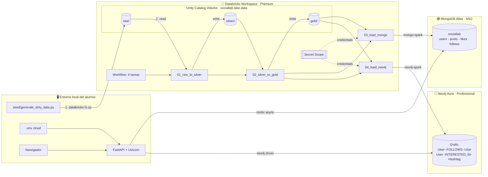

# SocialLab — Arquitectura Poliglota Cloud

Migración del stack local a un sistema poliglota distribuido en tres proveedores gestionados, manteniendo el principio rector del proyecto: **cambiar `.env`, no reescribir código**.

---

## 1. Resumen ejecutivo

| Componente     | Local (actual)         | Cloud (objetivo)            |
|----------------|------------------------|-----------------------------|
| Spark / ETL    | PySpark en `local[*]`  | **Databricks Workspace**    |
| OLTP documental| MongoDB Community      | **MongoDB Atlas**           |
| Grafo social   | Neo4j Community        | **Neo4j Aura**              |
| Data Lake      | `./data/{raw,silver,gold}` | **Databricks · Unity Catalog Volume** |
| API / Web      | FastAPI + Uvicorn      | FastAPI local (clase) o App Service |
| Secretos       | `.env`                 | `.env` + Databricks Secret Scopes |

El código Python (src/spark/, src/web/, src/seed/, src/models/) **no cambia**. Solo cambian:
- Variables de `.env`
- URIs de conexión (connection strings cloud)
- Ruta del data lake (`abfss://...` en lugar de `./data`)
- El `SparkSession` lo provee Databricks (en local lo crea `run_pipeline.py`)

---

## 2. Flujo de datos end-to-end

```
[1] Seed (local)  →  NDJSON sucio en ./data/raw/
[2] Upload        →  /Volumes/sociallab/lake/data/raw/  (Unity Catalog Volume)
[3] Databricks Job (raw → silver)    → /Volumes/.../silver/ (parquet)
[4] Databricks Job (silver → gold)   → /Volumes/.../gold/   (parquet)
[5] Databricks Job (load-mongo)      → MongoDB Atlas · sociallab db
[6] Databricks Job (load-neo4j)      → Neo4j Aura · grafo social
[7] FastAPI (local) ──── motor ────→ Atlas (lectura + escrituras live)
                    └── neo4j ────→ Aura  (lectura del grafo)
[8] Navegador del alumno → FastAPI local → datos cloud
```

El campo `origin` sigue siendo la frontera:
- `origin="seed"` — datos generados por `generate_dirty_data.py`, procesados por Databricks
- `origin="live"` — creados por los alumnos vía la API (escribe directo en Atlas)

---

## 3. Capa por capa

### 3.1 Data Lake — Unity Catalog Volume (gestionado por Databricks)

El data lake vive **dentro del propio Databricks** como un volumen de Unity Catalog. No hay storage account externo que provisionar ni mantener — Databricks gestiona el almacenamiento de fondo.

```
Catalog:  sociallab
Schema:   lake
Volume:   data

Rutas:
/Volumes/sociallab/lake/data/raw/     ← NDJSON (users, posts, likes, follows)
/Volumes/sociallab/lake/data/silver/  ← Parquet limpio (5 particiones, snappy)
/Volumes/sociallab/lake/data/gold/    ← Parquet agregado (user_stats, post_rankings, ...)
```

**Acceso:** transparente desde cualquier cluster en **Shared access mode**. La autorización la gestiona Unity Catalog vía `GRANT READ/WRITE VOLUME`.

**Ventajas para la práctica:**
- Un único proveedor que provisionar (Databricks)
- Sin Service Principal, sin OAuth, sin claves de storage
- Gobernanza (quién lee qué volumen) desde la UI de UC
- `databricks fs cp` sube datos directamente desde el portátil del alumno

**Si se quisiera un storage externo después** (producción): montar un external location en UC apuntando a S3/ADLS/GCS sin tocar código — solo cambia la definición del volumen.

### 3.2 Compute — Databricks Workspace

**Configuración recomendada para clase:**

| Elemento            | Valor                                       |
|---------------------|---------------------------------------------|
| Edición             | Premium (necesaria para Secret Scopes)      |
| Runtime             | 14.3 LTS (Spark 3.5.0 · Scala 2.12)         |
| Cluster ETL         | Job cluster, 1 driver + 2 workers (i3.xlarge o Standard_DS3_v2) |
| Cluster dev         | Single-node para notebooks de alumnos       |
| Unity Catalog       | Sí — catálogo `sociallab` con esquemas `raw/silver/gold` |
| Jobs / Workflows    | 4 tareas en cadena: `etl_silver → etl_gold → load_mongo → load_neo4j` |
| Secret Scope        | `sociallab` (almacena `MONGO_URI`, `NEO4J_URI`, `NEO4J_PASSWORD`) |

**Conectores instalados vía Maven en el cluster:**
- `org.mongodb.spark:mongo-spark-connector_2.12:10.4.0`
- `org.neo4j:neo4j-connector-apache-spark_2.12:5.3.1_for_spark_3`

**Notebooks importados desde `src/spark/`:**
- `etl_silver.py` → notebook `01_raw_to_silver`
- `etl_gold.py`   → notebook `02_silver_to_gold`
- `load_to_mongo.py` → notebook `03_load_mongo`
- `load_to_neo4j.py` → notebook `04_load_neo4j`
- `models/run_all.py` → notebook `05_ml_models`

### 3.3 OLTP — MongoDB Atlas

| Elemento        | Valor                                         |
|-----------------|-----------------------------------------------|
| Tier            | M10 dedicado (recomendado) o M0 gratuito (clase corta) |
| Región          | Misma que Databricks (p. ej. `eu-west-1`)     |
| Replica set     | 3 nodos (por defecto)                         |
| DB              | `sociallab`                                   |
| Colecciones     | `users`, `posts`, `likes`, `follows`, `hashtag_trends`, `user_stats`, `events` |
| Network Access  | IP allowlist (IP del cluster Databricks + IPs de los alumnos) o PrivateLink |
| Usuarios        | `sociallab_app` (readWrite), `sociallab_etl` (readWrite sobre sociallab) |

**Connection string:**
```
MONGO_URI=mongodb+srv://sociallab_app:<pwd>@cluster0.xxxx.mongodb.net/sociallab?retryWrites=true&w=majority
```

### 3.4 Grafo — Neo4j Aura

| Elemento        | Valor                                         |
|-----------------|-----------------------------------------------|
| Tier            | AuraDB Professional (4 GB) o Free (limitado a 200k nodos) |
| Región          | Misma que el resto                            |
| Base de datos   | `neo4j` (Aura solo permite una por instancia) |
| Constraints     | `User.id` UNIQUE, `Hashtag.name` UNIQUE       |
| Relaciones      | `FOLLOWS`, `INTERESTED_IN`                    |

**Connection string:**
```
NEO4J_URI=neo4j+s://<dbid>.databases.neo4j.io
NEO4J_USER=neo4j
NEO4J_PASSWORD=<generado por Aura>
```

### 3.5 API — FastAPI

Se queda **en el portátil del alumno**. Ventajas:
- El alumno ve los logs en su terminal
- No hace falta desplegar nada
- La API solo necesita salir a Internet (puerto 443) para hablar con Atlas y Aura

`src/web/database.py` no cambia: `motor` y el driver `neo4j` aceptan URIs `mongodb+srv://` y `neo4j+s://` sin modificaciones.

Si se quiere desplegar más adelante: Azure App Service, Render o Fly.io funcionan sin cambios.

---

## 4. Archivo `.env` para el modo cloud

```env
# Data Lake (Unity Catalog Volume dentro de Databricks)
DATA_LAKE_PATH=/Volumes/sociallab/lake/data

# MongoDB Atlas
MONGO_URI=mongodb+srv://sociallab_app:<pwd>@cluster0.xxxx.mongodb.net
MONGO_DB=sociallab

# Neo4j Aura
NEO4J_URI=neo4j+s://<dbid>.databases.neo4j.io
NEO4J_USER=neo4j
NEO4J_PASSWORD=<pwd>

# Spark → lo provee Databricks, no se usa desde el portátil
SPARK_MASTER=   # vacío en modo cloud

# Databricks (para subir datos al volumen y lanzar jobs desde local)
DATABRICKS_HOST=https://<workspace>.cloud.databricks.com
DATABRICKS_TOKEN=<PAT>
```

Dentro de Databricks, las credenciales de Atlas y Aura viven en el **Secret Scope** `sociallab`, no en `.env`:

```python
mongo_uri = dbutils.secrets.get("sociallab", "mongo_uri")
neo4j_uri = dbutils.secrets.get("sociallab", "neo4j_uri")
```

---

## 5. Plan de migración para la práctica

| Paso | Acción                                                          | Quién      |
|------|-----------------------------------------------------------------|------------|
| 1    | Crear workspace Databricks Premium + cluster Shared + Secret Scope | Profesor   |
| 2    | Crear catálogo `sociallab` + volumen `lake.data` (raw/silver/gold) | Profesor   |
| 3    | Provisionar Atlas M10 + Aura Professional                       | Profesor   |
| 4    | Importar notebooks desde `src/spark/` al workspace              | Profesor   |
| 5    | Configurar Workflow de 4 tareas + grants UC sobre el volumen    | Profesor   |
| 6    | Repartir credenciales (read-only Aura + read/write Atlas + PAT Databricks) a alumnos | Profesor   |
| 7    | Alumno ejecuta `./start.sh seed` en local                       | Alumno     |
| 8    | Alumno sube `data/raw/` con `databricks fs cp dbfs:/Volumes/sociallab/lake/data/raw/` | Alumno     |
| 9    | Alumno lanza el Workflow desde la UI de Databricks              | Alumno     |
| 10   | Alumno arranca FastAPI local con `.env` cloud y navega          | Alumno     |

---

## 6. Observabilidad y costes

- **Databricks**: jobs se apagan solos al terminar. Coste ≈ DBU/hora del cluster × duración del job. Con cluster pequeño y dataset de prácticas: < 1 €/ejecución completa. El almacenamiento del volumen UC se factura aparte pero es despreciable (< 1 €/mes para este volumen).
- **Atlas M10**: ~60 €/mes. Si es clase puntual, usar M0 gratuito (512 MB) con dataset reducido a ~10k usuarios.
- **Aura Professional**: ~65 €/mes. Alternativa gratis: AuraDB Free (200k nodos / 400k relaciones).

**Logs:**
- Databricks Jobs UI → driver logs, stdout de cada notebook
- Atlas → Performance Advisor + metrics
- Aura → Query Logs
- FastAPI → terminal local

---

## 7. Qué aprenden los alumnos

1. **Separación de responsabilidades**: un motor por tipo de consulta (documental, grafo, analítica).
2. **ETL en cloud**: leer raw sucio, ganar confianza en silver, producir gold agregado.
3. **Conectores Spark** (mongo-spark, neo4j-spark): cómo Spark habla con OLTP y grafos.
4. **Secretos gestionados**: `.env` local vs Secret Scope en cloud.
5. **Coste de cada decisión**: por qué no todo cabe en Postgres, y por qué no todo debe ser Spark.

---

## 8. Diagrama

Ver [architecture_polyglot.svg](architecture_polyglot.svg) (diagrama estilo AWS) y el bloque Mermaid al final.

### Mermaid (versión textual)


